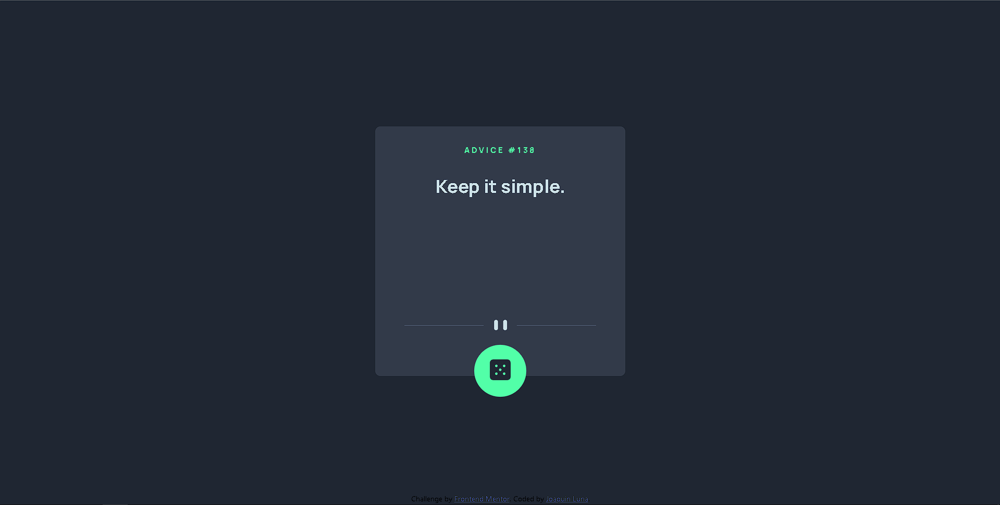

# Frontend Mentor - Advice generator app solution

This is a solution to the [Advice generator app challenge on Frontend Mentor](https://www.frontendmentor.io/challenges/advice-generator-app-QdUG-13db). Frontend Mentor challenges help you improve your coding skills by building realistic projects.

## Table of contents

- [Overview](#overview)
  - [The challenge](#the-challenge)
  - [Screenshot](#screenshot)
  - [Links](#links)
- [My process](#my-process)
  - [Built with](#built-with)
  - [Useful resources](#useful-resources)
- [Author](#author)

## Overview

### The challenge

Users should be able to:

- View the optimal layout for the app depending on their device's screen size
- See hover states for all interactive elements on the page
- Generate a new piece of advice by clicking the dice icon

### Screenshot

### Links

- Live Site URL: [Add live site URL here] (https://advice-generator-app-liart-pi.vercel.app )

## My process

### Built with

- [React](https://reactjs.org/) - JS library
- API fetch
- Vercel hosting
- Semantic HTML5 markup
- CSS custom properties and variables
- CSS animations
- Flexbox
- Mobile-first workflow

### Useful resources

- [API](https://api.adviceslip.com/) - This resource was really useful to me because it allowed me to develop the challenge by consuming it's API.

## Author

- Website - [Joaquin Luna ](https://portfolio-joa.web.app/)
- Frontend Mentor - [@JoacoLuna4](https://www.frontendmentor.io/profile/JoacoLuna4)
- LinkedIn - [joaquin-luna](https://www.linkedin.com/in/joaquin-luna/)
